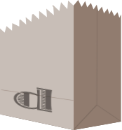

# PUT YOUR DATA IN A BAG



Pretty simple library for just splatting stuff to disk and getting it back out
with minimal fuss.

## wait...

This is sort of like a nosql db on top of an sql db, right?

Yep.

# features

* Easy to use and quite efficient at accessing relatively large number of items
  (not talking big data here, but a couple of thousand items works well)
* Requires no other libs, everything is python batteries included.
* Built on top of sqlite3 so it's fast and stable (which is included in Python
  stdlib)
* Easy to use - just create one and use it like a dictionary. Most dict methods
  supported. Also can add to it like a set by not specifying a key.  One will
  be created on the fly.
* Mostly well tested
* Ideal for running on small vm instances.  Doesn't require any other daemon to
  provide data access
* Core code is about ~~100~~ 200 lines - very easy to understand.
* Automatically compresses data with bz2 in cases that benefit from it
* You can always query the data with native sqlite3 libs from other languages
  if you need to.  It's just strings in the database.
* Since the underlying datafile is sqlite3, multiple processes can work with
  the same file (multiple read, write locks, etc)
* Every object gets a ts object attached to it for convenience when it's saved.
  This is accessed via `bag.when('key')`

## versioning

Simple versioning is possible.  Just create your DataBag like:

```python
>>> dbag = DataBag(versioned=True)
```

and then you can do things like...

```python
>>> dbag['blah'] = 'blip'
>>> dbag['blah'] = 'new blip'
>>> dbag['blah'] = 'newer blip'
>>> dbag.get('blah', version=-2)
u'blip'
>>> dbag.get('blah', version=-1)
u'new blip'
>>> dbag.get('blah')
u'newer blip'
>>> dbag['blah']
u'newer blip'
```

The default is to keep 10 versions but that can be set with the `history`
parameter when initializing your bag.

A bag.get(...) method works much like a dictionary's `.get(...)` but with an
additional keyword argument of `version` that indicates how far back to go.

# examples

## very simple example

```python
>>> from databag import DataBag
>>> bag = DataBag() # will store sqlite db in memory
>>> bag['xyz'] = 'some string' # will save in the db
>>> s = bag['xyz'] # retrieves from db
>>> s
'some string'
>>> 'xyz' in bag # True
True
>>> bag['abc'] = {'x':22, 'y':{'a':'blah'}} # works
>>> bag['abc']
{u'y': {u'a': u'blah'}, u'x': 22}
>>> [k for k in bag]
['abc', 'xyz']
>>> bag.when('xyz')
datetime.datetime(2011, 12, 31, 2, 45, 47, 187621)
>>> del bag['xyz']
>>> 'xyz' in bag
False
>>> meh = DataBag(bag='other') # set name of storage table
```

## DictBag example

```python
>>> from databag import DictBag, Q
>>> d = DictBag()
>>> d.ensure_index(('name', 'age'))
>>> person1 = {'name':'joe', 'age':23}
>>> person2 = {'name':'sue', 'age':44}
>>> d.add(person1)
'fachVqv6RxsmCXAZgJMJ5p'
>>> d.add(person2)
'fpC7cAtx2ZQLadprQR7aa6'
>>> d.find(Q('age')>40).next()
(u'fpC7cAtx2ZQLadprQR7aa6', {u'age': 44, u'name': u'sue'})
>>> age = Q('age')
>>> [p for p in d.find(20 < age < 50) ]
[(u'fachVqv6RxsmCXAZgJMJ5p', {u'age': 23, u'name': u'joe'}),
	(u'fpC7cAtx2ZQLadprQR7aa6', {u'age': 44, u'name': u'sue'})]
>>>
```

## limitations

* although a lot of the basic data types in python are supported for the values
  (lists, dictionaries, tuples, ints, strings)... datetime objects can be saved
  fine but they come out of the bag as an iso format string of the original
  datetime.
* when saving a dictionary, the keys must be a string in the dictionary.  If
  they are not, they will be when coming back from the bag
* if using versioning, be sure to instantiate your DataBag object with
  versioning enabled and the same `history` size each time. Failure to do so
  will cause interesting things to happen, in particular, your databag will act
  unversioned and overwrite recent updates w/o cascading the historical change
  to records.


## Further notes

The [DictShield library](https://github.com/j2labs/dictshield) makes an
excellent compliment to creation of models that map and store quite nicely in
DictBags.

